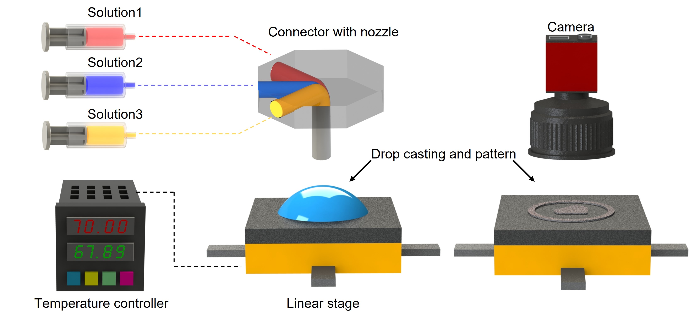
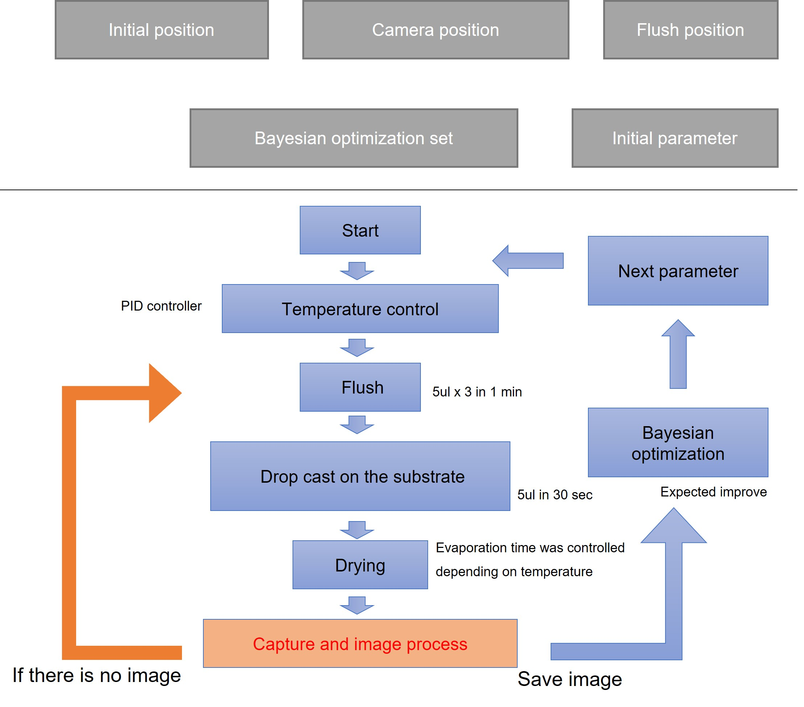

# dropcast_AE
Made by Minki Lee during his Postdoc at the Osuji group of the University of Pennsylvania.

Python program to conduct dropcast using syringe pump, linear stage, temperature controller and camera.  

Before start the experiment, you can set the initial postion, camera position, bound of temprature, flow rate, voltage and experiment time.

## Screenshot

## Hardware List
* Temperature controller - Omega platinum series(omega) X1
* Syringe pump - PHD ULTRA(Harvard apparatus) X3
* Linear stage - ESP301(Newport) X2
* Camera - USB camera X1

## Support
If you have any questions feel free email or open an issue on github.

## Some details
* The code is written for Python 3.1
* Light is needed to do the image processing of drying pattern on wafer substrate

